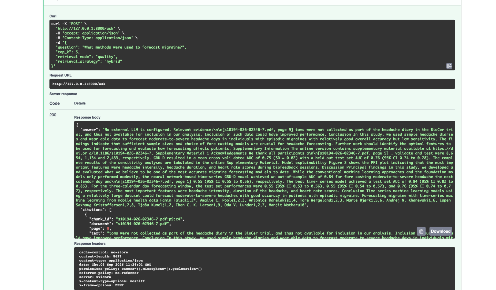
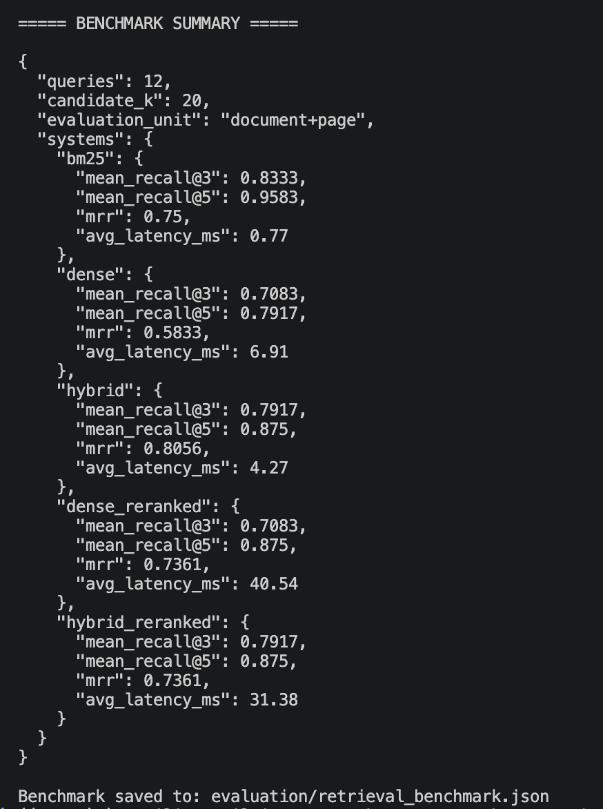
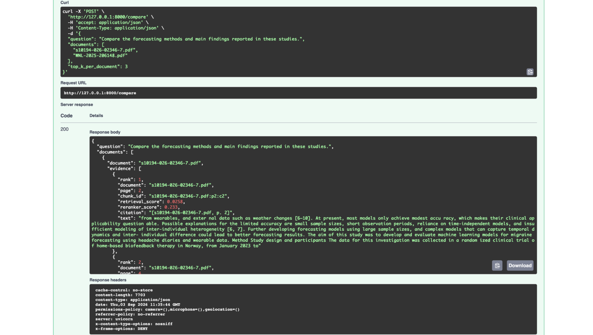

# Research RAG Assistant

[](https://github.com/vasilischr01/Research-rag-assistant/actions/workflows/ci.yml)


Production-style Retrieval-Augmented Generation backend for scientific PDF analysis, combining **dense retrieval, BM25, Reciprocal Rank Fusion (RRF), cross-encoder reranking, citation-aware retrieval, multi-document comparison, and quantitative evaluation**.

Built with **Python, FastAPI, Sentence Transformers, FAISS, BM25, PyTorch, Docker, pytest, Ruff, and GitHub Actions**.

---

## What It Does

- Ingests scientific PDFs with page-aware text extraction and chunking
- Builds both **dense FAISS** and **BM25 lexical** retrieval indexes
- Combines dense and lexical rankings using **Reciprocal Rank Fusion**
- Supports optional **cross-encoder reranking**
- Returns evidence with **document, page, and chunk provenance**
- Provides citation-aware question answering
- Compares evidence across multiple research documents
- Benchmarks retrieval strategies using **Recall@3, Recall@5, MRR, and latency**
- Exposes the complete workflow through a **FastAPI REST API**

The default retrieval strategy is **Hybrid RRF**, selected from measured benchmark results rather than by assumption.

---

## Architecture

```text
                         Scientific PDFs
                               |
                               v
                    Page-Aware PDF Parsing
                               |
                               v
                      Overlapping Chunks
                               |
                 +-------------+-------------+
                 |                           |
                 v                           v
        Sentence Transformer              BM25
             Embeddings                 Lexical Index
                 |
                 v
           FAISS Vector Index
                 |                           |
                 +-------------+-------------+
                               |
                               v
                    Reciprocal Rank Fusion
                               |
                               v
                        Ranked Evidence
                               |
                 +-------------+-------------+
                 |                           |
                 v                           v
        Citation-Aware Q&A         Multi-Document Compare
```

Five retrieval strategies are available:

`dense` · `bm25` · `hybrid` · `dense_reranked` · `hybrid_reranked`

---

## Demo

### Citation-Aware Retrieval

A scientific question is processed through the Hybrid RRF pipeline and returned with ranked evidence and document/page provenance.



### Retrieval Evaluation

The benchmark compares five retrieval configurations across 12 manually curated research queries using document + page relevance annotations.



### Multi-Document Comparison

The `/compare` pipeline retrieves and reranks evidence independently across multiple scientific papers while preserving source provenance.



---

## Benchmark Results

The current benchmark evaluates **12 manually curated research queries** with `candidate_k = 20`.

| Retrieval Strategy | Recall@3 | Recall@5 | MRR | Avg. Latency |
|---|---:|---:|---:|---:|
| **BM25** | **0.8333** | **0.9583** | 0.7500 | **0.77 ms** |
| Dense FAISS | 0.7083 | 0.7917 | 0.5833 | 6.91 ms |
| **Hybrid RRF** | 0.7917 | 0.8750 | **0.8056** | 4.27 ms |
| Dense + Cross-Encoder | 0.7083 | 0.8750 | 0.7361 | 40.54 ms |
| Hybrid + Cross-Encoder | 0.7917 | 0.8750 | 0.7361 | 31.38 ms |

### Key Findings

- **Hybrid RRF achieved the highest MRR: 0.8056**
- **BM25 achieved the highest Recall@5: 0.9583**
- Hybrid RRF improved MRR by approximately **38.1%** relative to the dense FAISS baseline
- Cross-encoder reranking improved the dense baseline but did not outperform Hybrid RRF on MRR
- Hybrid RRF therefore remains the default retrieval strategy

Latency values are local measurements and are hardware/runtime dependent.

---

## Engineering Highlights

### Hybrid Retrieval

Dense semantic retrieval and BM25 lexical retrieval operate over the same page-aware chunk collection. Their rankings are combined through **Reciprocal Rank Fusion**, avoiding direct score calibration between heterogeneous retrieval systems.

### Citation Provenance

Retrieved evidence preserves:

```text
document
page
chunk_id
text
retrieval scores
```

This allows responses and document comparisons to remain grounded in identifiable source evidence.

### Multi-Document Comparison

The comparison pipeline:

1. Retrieves evidence across the requested documents
2. Combines dense and lexical rankings with RRF
3. Separates candidates by document
4. Applies per-document cross-encoder reranking
5. Returns the strongest evidence for each paper
6. Produces an extractive comparison summary

### Evaluation

The project includes a reproducible retrieval benchmark comparing:

```text
BM25
Dense FAISS
Hybrid RRF
Dense + Cross-Encoder
Hybrid + Cross-Encoder
```

Evaluation uses **document + page relevance annotations** rather than page numbers alone to avoid collisions across PDFs.

### API Reliability

The FastAPI layer includes:

- PDF extension, MIME type, and `%PDF-` signature validation
- Streaming upload-size enforcement
- Duplicate-file protection
- Request-size limits
- Rate limiting
- Security headers
- Sanitized client-facing errors

---

## API

| Method | Endpoint | Purpose |
|---|---|---|
| `GET` | `/health` | Service and index health |
| `POST` | `/documents/upload` | Upload and index a PDF |
| `POST` | `/search` | Retrieve ranked evidence |
| `POST` | `/ask` | Citation-aware question answering |
| `POST` | `/compare` | Compare evidence across documents |

Interactive API documentation is available at `/docs` when the service is running.

---

## Quality & Validation

Current engineering validation:

```text
27 automated tests passed
Ruff: All checks passed
GitHub Actions CI
Dockerized execution
Five-way retrieval benchmark
Candidate-pool ablation
Security and upload validation tests
```

The automated test suite covers API behavior, retrieval strategies, BM25, RRF, document comparison, chunking, vector-store functionality, upload validation, rate limiting, and error handling.

---

## Tech Stack

**Backend:** Python 3.11, FastAPI, Uvicorn, Pydantic

**Retrieval / ML:** PyTorch, Sentence Transformers, FAISS, BM25, Reciprocal Rank Fusion, Cross-Encoder reranking

**Document Processing:** PyMuPDF

**Engineering:** Docker, pytest, Ruff, GitHub Actions

---

## Run Locally

```bash
git clone https://github.com/vasilischr01/Research-rag-assistant.git
cd Research-rag-assistant

python3 -m venv .venv
source .venv/bin/activate

pip install -r requirements.txt

uvicorn src.api.main:app --reload
```

Then open:

```text
http://127.0.0.1:8000/docs
```

### Docker

```bash
docker build -t research-rag-assistant .
docker run -p 8000:8000 research-rag-assistant
```

---

## Run the Evaluation

```bash
python -m src.evaluation.retrieval
```

Candidate-pool ablation:

```bash
python -m src.evaluation.ablation
```

Run tests and linting:

```bash
pytest -q
ruff check .
```

---

## Limitations

- The current benchmark contains 12 manually curated research queries
- Evaluation relevance is document/page-level rather than chunk-level
- Retrieval evaluation does not yet measure full generated-answer faithfulness
- Multi-document summaries are extractive when no external language model is configured
- Benchmark latency is hardware and runtime dependent
- FAISS and BM25 are currently designed for local rather than distributed retrieval

---

## Why This Project

This project treats RAG as an **information-retrieval engineering problem**, not only an LLM prompting exercise.

It demonstrates hybrid retrieval, neural reranking, evidence provenance, quantitative evaluation, benchmark-driven architecture decisions, quality-latency trade-offs, API engineering, automated testing, and multi-document research workflows.

---

## License

MIT License.